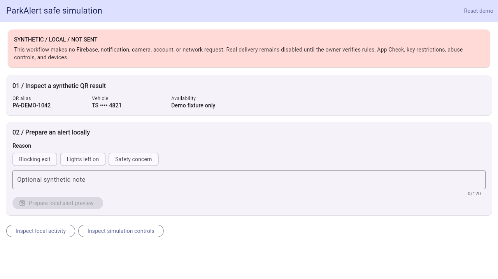

# ParkAlert India

> **Experimental security hold:** the credential-free local simulation is runnable. Real QR lookup, alert delivery, Firebase deployment, notifications, and public release remain disabled until the repository owner verifies the external security checklist.

[](docs/demo/demo.mp4)

[Watch MP4](docs/demo/demo.mp4) · [Download WebM](docs/demo/demo.webm) · [Captions](docs/demo/demo-captions.vtt) · [Checksums](docs/demo/SHA256SUMS.txt)

ParkAlert explores a QR-mediated way to prepare a parking alert without publishing an owner's phone number. Its safe simulation demonstrates the interaction locally with synthetic data and no Firebase, camera, account, notification, or network request.

The 3:08 narrated walkthrough records the real credential-free build at 1280×720. It uses only synthetic data and shows the safe boundary, QR fixture, reason and note, unsent review, simulated inbox, local resolution, activity, simulation controls, and remaining release gates. The older 55-second portfolio asset must not replace this candidate until the branch is approved.

## Verified local workflow

1. Inspect a synthetic QR alias and masked vehicle label.
2. Choose an alert reason and enter an optional synthetic note.
3. Review a **local preview — no message sent** state.
4. Add the alert to a simulated owner inbox.
5. Resolve it locally with no external side effect.

Run it with:

```bash
flutter pub get
flutter run -d chrome --dart-define=DEMO_MODE=true
```

No credential is required for this workflow.

## Security boundary

- `android/app/google-services.json` is ignored; only a placeholder example is tracked.
- `lib/firebase_options.dart` fails closed until the owner generates a local configuration.
- `ScanService.recordAlert` refuses direct client writes. A trusted, abuse-controlled backend must be implemented and verified first.
- The tracked `firestore.rules` deny direct alert creation, scan-log access, QR reads, unknown paths, and cross-user access. They are reference rules until deployment is independently verified.
- No notification Function source or deployed trigger is included or claimed.
- App Check, authorized domains, API-key restrictions/rotation, deployed rules, authentication policy, quotas, rate limits, notification delivery, and device recovery remain external owner checkpoints.

## Verify the repository

```bash
flutter analyze
flutter test
flutter build web --release --dart-define=DEMO_MODE=true
```

Tests cover the complete local lifecycle, its disabled precondition, validation, deny-by-default rules structure, and the absence of direct client alert writes.

## Real Firebase mode

Real mode is intentionally not runnable from this repository checkout. Before any release or real-data test, the owner must:

1. Rotate or restrict the historically exposed Firebase client key and retain redacted evidence.
2. Generate local platform configuration with `flutterfire configure` without committing it.
3. Review and deploy Firestore rules; verify them with the emulator and a separate project.
4. Enable and enforce App Check where supported, restrict authorized domains and API keys, and set quotas/abuse controls.
5. Implement a trusted alert-delivery backend; direct client creation stays denied.
6. Validate authentication, notification permission denial, token lifecycle, background delivery, retry/failure states, blocking, and deletion on owned devices.

Until every item is evidenced, there is no release, production, pilot, live-user, latency, reliability, or security-completion claim.

See [PROJECT_COMPLETION_REPORT.md](PROJECT_COMPLETION_REPORT.md), [SECURITY.md](SECURITY.md), [docs/ARCHITECTURE.md](docs/ARCHITECTURE.md), and [docs/TEST_REPORT.md](docs/TEST_REPORT.md).

## License status

No license file is present. All rights remain with the copyright holder unless an ownership-informed license is added manually.
