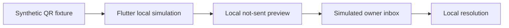

# ParkAlert India architecture

## Qualified path

This path uses `ParkAlertDemoApp`, `DemoDashboardScreen`, and `DemoModeController`. It initializes no Firebase service and performs no camera, authentication, notification, persistence-backend, or network action.

## Held real-service path

The repository contains Firebase-oriented client services for authentication, vehicles, tokens, alerts, and QR scanning. That path is not qualified:

- local platform configuration is intentionally absent;
- QR reads and direct client alert/scan-log writes are denied by the reference rules;
- `ScanService.recordAlert` fails with `trusted_backend_required`;
- no trusted alert-delivery Function or service is implemented;
- reference rules are not claimed as deployed;
- console and device controls are unverified.

## Intended trust boundary

A future scanner should submit a bounded request to an authenticated, App-Check-protected, rate-limited backend. The backend—not an arbitrary client—would resolve a QR mapping, apply blocking/abuse policy, create the owner's alert and audit record, and request notification delivery. Owner clients would read and update only their own data.

Until that backend and its external controls are reviewed, the real-service path remains disabled.
