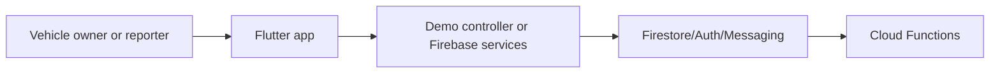

# ParkAlert India architecture

Flutter parking-contact prototype using QR-mediated alerts, privacy-aware demo data, Firebase services, and optional Cloud Functions.

## System view

## Component boundaries

- **Vehicle owner or reporter:** initiates the primary workflow.
- **Flutter app:** owns one stage of the request or interaction flow.
- **Demo controller or Firebase services:** owns one stage of the request or interaction flow.
- **Firestore/Auth/Messaging:** owns one stage of the request or interaction flow.
- **Cloud Functions:** provides the terminal integration or persistence boundary.

## Runtime and trust boundaries

Real Firebase mode requires an owner-supplied local configuration; the repository test is currently a placeholder smoke test. Inputs crossing a network, filesystem, provider, or database boundary should be validated and logged without sensitive values. Optional integrations must fail clearly rather than being presented as successful.

## Technology

Flutter/Dart, Firebase Auth/Firestore/Messaging/Analytics, TypeScript Cloud Functions.

